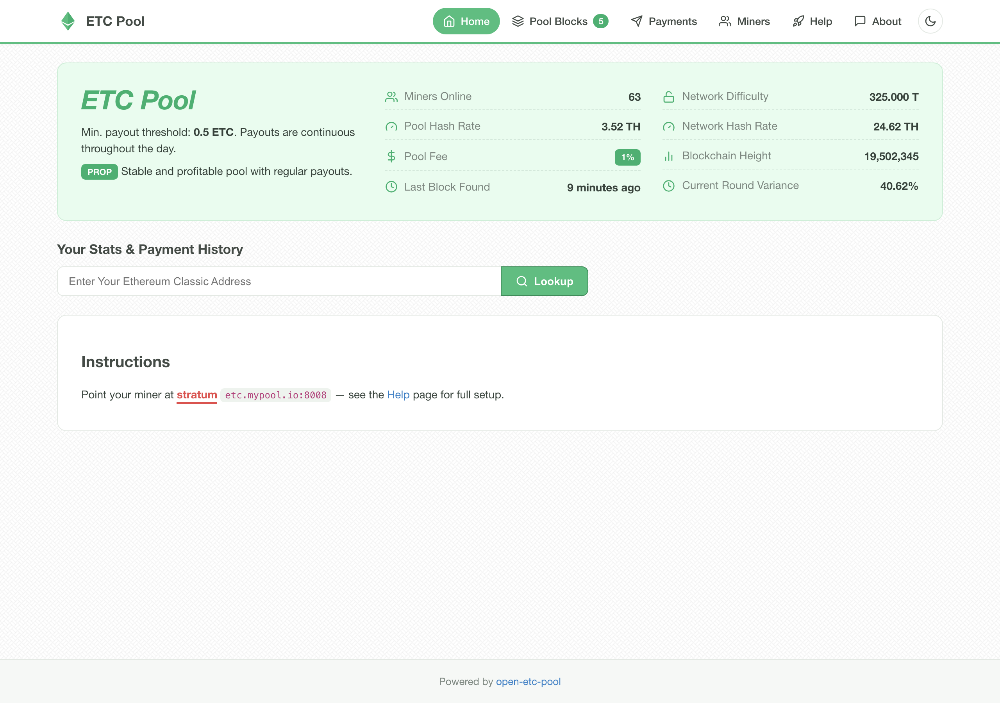
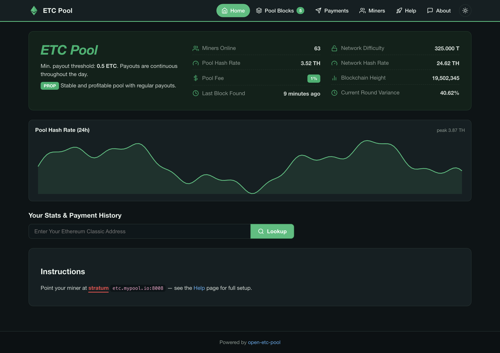
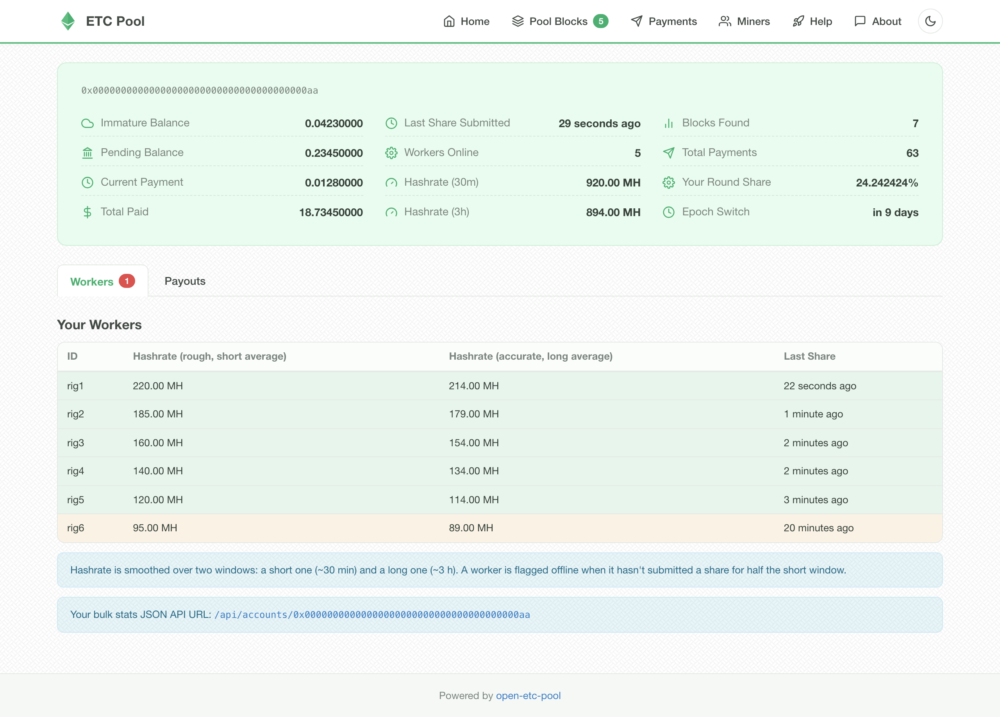
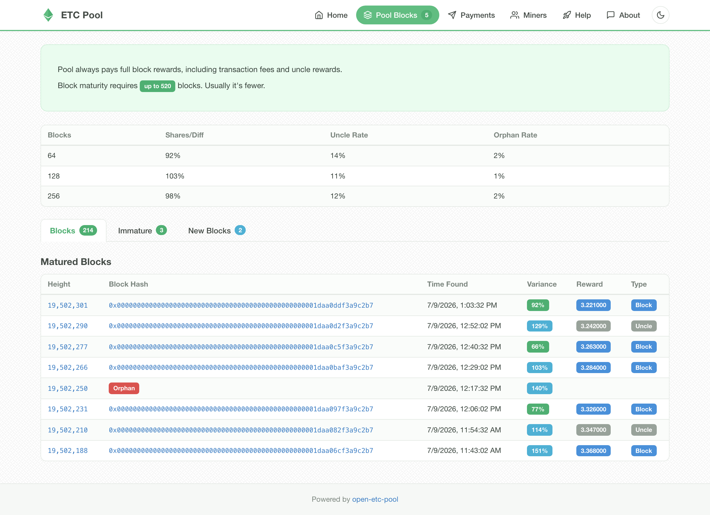

# open-etc-pool

An open-source **Ethereum Classic** mining pool: a single Go binary that ingests
shares over HTTP getwork and Stratum, verifies Etchash (ECIP-1099) proof-of-work,
unlocks blocks and pays miners (ECIP-1017 rewards), backed by Redis. Ships with a
Svelte single-page frontend and Prometheus metrics.

ETC is Proof-of-Work (Etchash) and absorbed large GPU hashrate after Ethereum's
2022 Merge, so a maintained ETC pool has real use.

|  |  |
|---|---|
|  |  |
|  |  |

## Features

- HTTP getwork and Stratum (eth-proxy style) mining ingress
- Etchash / ECIP-1099 dual-epoch PoW verification (via `go-etchash`)
- Block unlocking and ECIP-1017 era rewards, uncle & tx-fee rewards, PROP payouts
- Redis datastore; poll-based JSON-RPC to a geth-like node with failover
- Ban / rate-limit policy module
- Read-only JSON API (`/api/stats`, `/api/accounts/:login`, `/api/blocks`, `/api/miners`, `/api/payments`)
- Prometheus `/metrics` endpoint (shares, blocks, upstream health, stratum sessions)
- Pool and per-miner 24h hashrate charts (dependency-free, CSP-safe)
- Modern Svelte + Vite frontend with light/dark themes

## Architecture

One binary with four independently toggleable modules wired in `main.go`, so you
can run them in one process or split them across hosts:

- **proxy** — share ingestion (HTTP + Stratum), PoW verification
- **api** — the read-only JSON API the frontend polls
- **unlocker** — matures found blocks and credits round rewards
- **payouts** — sends payments once a miner is over the threshold

Redis is the datastore; each module talks to a `core-geth` (or any geth-compatible)
node over JSON-RPC.

## Requirements

- Go 1.24+ (a [`core-geth`](https://github.com/etclabscore/core-geth) fork of go-ethereum is vendored via the `replace` in `go.mod`)
- Redis 8
- A synced `core-geth` node for the network you mine (classic or mordor)
- Node.js 22+ to build the frontend

The repo pins toolchains with [mise](https://mise.jdx.dev) (`mise.toml`); `mise install`
gives you the right Go and Node.

## Build & run the backend

```sh
go build -o open-etc-pool .
```

Copy the sample config and edit it (it has comments, so it is not strict JSON —
the loader tolerates them):

```sh
cp config.example.json config.json
./open-etc-pool config.json
```

Run each module in its own process/config for a distributed setup (see
[Notes](#notes)). Tests need a local Redis:

```sh
docker run -p 6379:6379 redis:8      # or: redis-server
go test -race ./...
```

## Frontend (`web/`)

A Vite + Svelte + TypeScript SPA that polls the API and is served as static files
by nginx. It reads its settings at runtime from `config.json` (fetched at startup),
so endpoints and labels change without a rebuild.

```sh
cd web
npm ci
# edit public/config.json: apiUrl, explorerUrl, stratumHost/Port, network, poolFee…
npm run build          # -> web/dist
npm run dev            # local dev server, proxies /api to :8080
```

Point nginx at `web/dist` and proxy `/api` to the pool's API port — see
[`misc/nginx-default.conf`](misc/nginx-default.conf), which also sets a
Content-Security-Policy and other security headers.

## Deploy

- **Docker Compose** — [`docker-compose.yml`](docker-compose.yml) runs the pool
  (image `ghcr.io/etclabscore/open-etc-pool:latest`, published by CI) plus Redis.
- **Nix** — [`flake.nix`](flake.nix) builds the binary (`nix build .#default`), a
  reproducible OCI image (`nix build .#dockerImage`), and exposes a **NixOS module**
  and a dev shell.
- **systemd** — [`misc/open-etc-pool.service`](misc/open-etc-pool.service).

## Metrics

When `metrics.enabled` is set, the pool serves Prometheus metrics on
`metrics.listen`: Go runtime/process telemetry plus pool metrics —
`oep_shares_total{status}`, `oep_blocks_found_total`,
`oep_block_submissions_total{result}`, `oep_stratum_sessions`,
`oep_upstream_healthy{url}`. Scrape them into Grafana for a pool dashboard.

## Configuration

Start from [`config.example.json`](config.example.json); the keys are commented
there. A few worth calling out:

- `network` — `classic` or `mordor`.
- `proxy.behindReverseProxy` — when true, the client IP is taken from the
  **rightmost** `X-Forwarded-For` hop, i.e. the address your own proxy appends
  (nginx `$proxy_add_x_forwarded_for`). Don't enable it unless a trusted proxy
  fronts the pool.
- `proxy.difficulty` — the fixed share difficulty.
- `blockUnlocker` / `payouts` — run these as separate instances; see below.
- `metrics` — the Prometheus endpoint above.

Domain docs: [PAYOUTS](docs/PAYOUTS.md) · [POLICIES](docs/POLICIES.md) · [STRATUM](docs/STRATUM.md).

## Notes

- Run **payouts** and **unlocker** as their own processes with their own configs,
  and make sure exactly one instance of each is running — they mutate balances.
- Keep them off the mining node; point them at a node whose account can sign
  payout transactions.
- If `poolFeeAddress` is unset, pool profit stays on the coinbase address; if set,
  keep a little dust on it for gas.

## Limitations

- **PROP payouts only** — no SOLO or PPLNS scheme yet.
- **No NiceHash support** — the pool speaks the eth-proxy stratum protocol, not
  the `EthereumStratum/1.0.0` variant NiceHash uses; the `stratum_nice_hash`
  config block is a placeholder (see [`docs/STRATUM.md`](docs/STRATUM.md)).
- **No exchange price feed** — balances are shown in ETC, not fiat.

## Mordor (testnet)

Set `network` to `mordor` in the pool config, and `network` to `mordor` in
`web/public/config.json` so the frontend uses testnet parameters and shows the
testnet warning.

## Credits

Descends from Sammy007's [open-ethereum-pool](https://github.com/sammy007/open-ethereum-pool);
the ETC-specific work (Etchash/ECIP-1099, ECIP-1017 rewards) and the 2026
modernization (core-geth, go-redis/v9, Svelte frontend, CI, metrics, security
hardening) live here.
